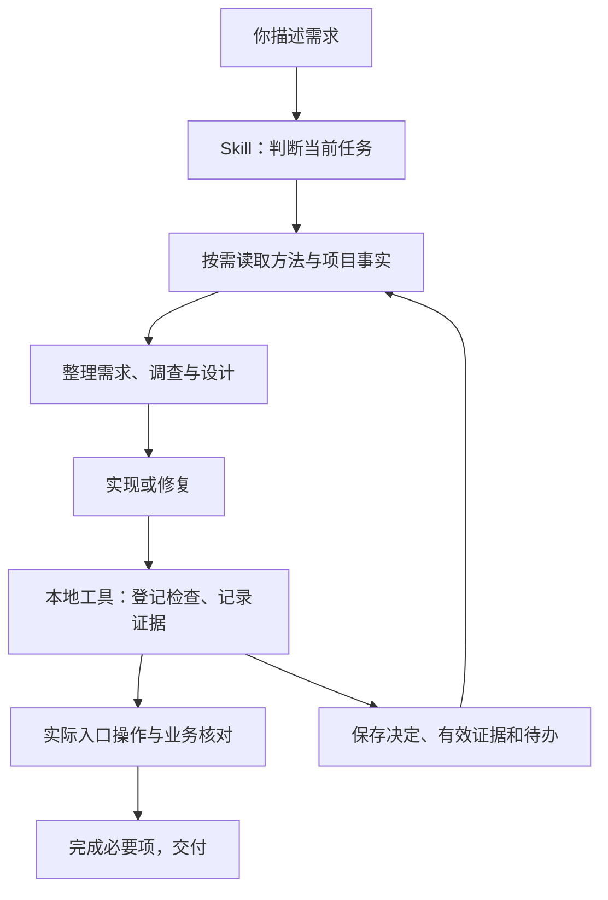

# CE 技术架构

CE 将“判断下一步做什么”与“核对实际执行结果”连接起来。Codex 理解需求、选择方法；本地工具处理配置、文件身份和检查记录；项目原件提供决定与验收依据。

## 总体结构

方法按当前任务接入。明确小改可以直接实施；有效旧决定可以继续沿用；产品目标和方案存在关键未知时，再进入调查与设计。

## 三部分怎样配合

| 部分 | 职责 | 主要实现 |
| --- | --- | --- |
| 协作方法 | 辨别任务，选择需求、调查、设计、排错和验证方法；相关参考按需加载 | [Skill](skills/codex-engineering/SKILL.md)及references |
| 本地工具 | 核项目绑定与授权，运行登记检查，计算输入指纹，保存回执和状态 | [binding](src/binding.mjs)、[runner](src/runner.mjs)、[engineering-rules](src/engineering-rules.mjs) |
| 项目记录 | 连接需求、功能、实现、验收与接续资料，保留来源和历史 | [feature](src/feature.mjs)、[acceptance](src/acceptance.mjs)、[task-context](src/task-context.mjs) |

项目配置提供实际目录、文档、环境、检查和权限。公共方法复用于不同项目，具体业务规则留在原项目；本机运行绑定和记录留在私有目录。

## 必要调查如何触发

Skill 的任务描述覆盖新增功能、方案、可行性和性能选择。Codex 根据请求与项目事实判断：还有哪些未知，会改变本次决定？因此，你可以直接提出功能或性能问题，CE 仍会引导必要调查。

流程先读取有效旧决定，再查官方文档、公开资源、许可证、维护条件和适用示例。产品价值需要确定时，补用户、市场与竞品探索；技术选型围绕产品阶段、现有结构和运行环境比较候选。

选型优先复用已有能力、原生能力和合适的公开组件；维护成本适合当前项目时采用。有限查找后仍需自研的，借鉴已有原理实现必要范围。已有依据足够支持决定时，进入实施。

对应方法：[resource-reuse](skills/codex-engineering/references/resource-reuse.md)、[requirements](skills/codex-engineering/references/requirements.md)、[ui-design](skills/codex-engineering/references/ui-design.md)。

## 检查怎样复用

检查先登记到项目配置，经过 CE 运行器执行。运行器对检查定义、声明输入、环境键、可执行文件和平台计算指纹，并保存原始输出与回执。

- 同一指纹已有通过回执时，重新执行需要说明理由。
- 同一指纹此前失败时，再次执行需要新的诊断证据。
- 文件、规则、环境或原件发生变化时，重新核对相关证据的有效性。

任务资料汇集必需检查、真实验收目标、可复用证据、待办和扩大范围的新事实，沿用现有结果记录。程序检查、整体UI审查和实际业务验收各有职责；完成本次必要项后停止。

程序规则在经过 CE 入口的检查和已声明范围内生效。真实账号、远端状态、页面体验与业务结果，由实际操作和审查核对。对应实现：[runner](src/runner.mjs)、[task-context](src/task-context.mjs)、[ui-review](src/ui-review.mjs)。

## 借鉴思想与来源

| 思想或资源 | 在 CE 中的采用方式 |
| --- | --- |
| 证据优先 | 决定、故障原因和验收结果关联原件，未知与待审状态持续保留 |
| 按阶段和风险投入 | 方法与验证围绕当前目标选择，小改保持短流程 |
| 按需加载 | Skill 先判断任务，只读取相关方法与必要项目资料 |
| 结果复用与停止条件 | 有效回执继续使用；扩检说明新事实；完成与预算停止分别记录 |
| Pstack 排错协议 | 固定来源提交，接入只读调查、缺陷修复、运行现场诊断和追踪原件分析四类协议 |
| html-validate 10.9.0 | 打包 HTML 解析与源码规则检查 |
| axe-core 4.13.0 | 打包浏览器可访问性检查引擎 |
| Ant Design、Carbon、W3C及平台指南 | 按具体交互问题查阅，记录适合当前项目的采用理由 |

Pstack 来源与采用范围见[source-lock](upstream/pstack/source-lock.json)和[route-catalog](upstream/pstack/route-catalog.json)；工具版本见[UI工具清单](vendor/ui-tools/manifest.json)；许可见[第三方说明](THIRD_PARTY_NOTICES.md)。这些资源保留各自来源、归属与许可证。

## CE 的设计特点

CE 的创新定位在协作流程的组合与工程化，具体体现在：

1. **从自然需求接入方法**：用户描述结果，Codex根据任务选择必要步骤，减少每次重写完整开发提示词的负担。
2. **将判断与核验配合**：语义和产品选择交给模型结合事实判断，配置、指纹、回执和历史由程序处理。
3. **让证据能够接续使用**：原决定、检查和验收连接到当前任务，变化时核有效性，中断后继续待办。
4. **把结束条件放进流程**：必要检查、实际验收与完成条件一起记录，验证投入随新事实调整。
5. **公共方法与项目具体值分开**：同一套方法可用于多个项目，各自保持权限、环境和业务规则。

## 数据与可选服务

核心流程使用本地文件与现有项目工具。Jev 为可选语义实验模块，采用明确命题与yes/no/unknown答案，日常用途默认关闭。实验调用单独核外发材料、授权、累计次数与费用；版本、字段、来源和权限等确定性事项由程序检查。

[验证记录](PUBLIC-VALIDATION.md)说明已经观察到的行为、实际环境与计量范围。
